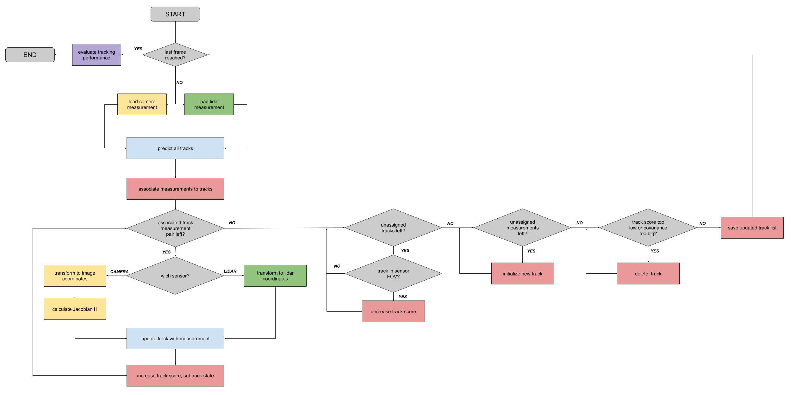
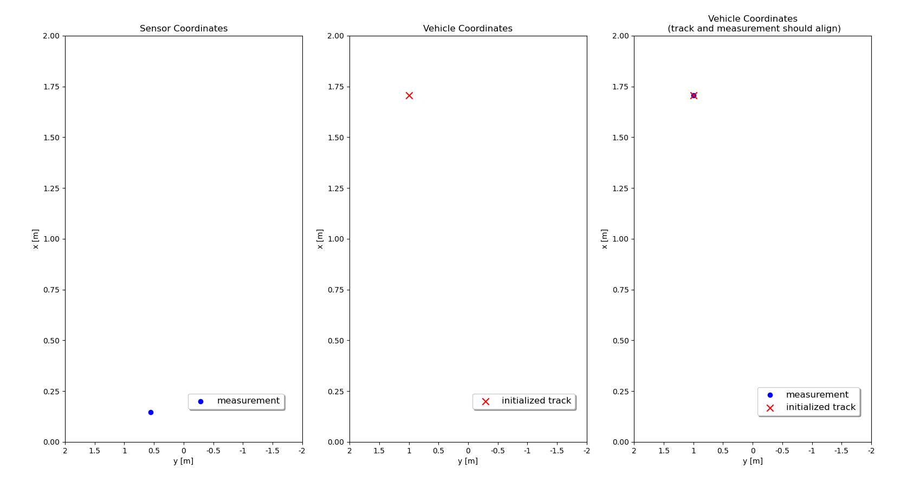
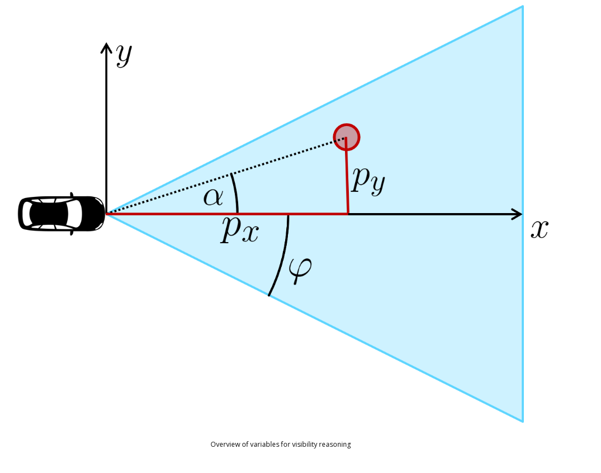
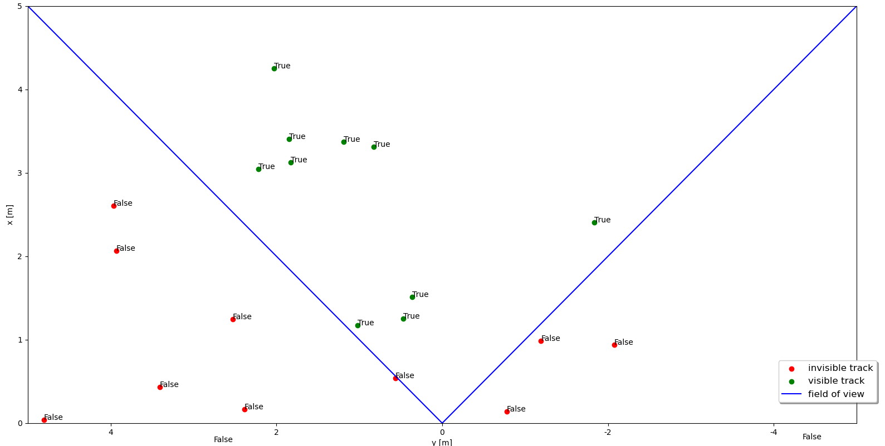
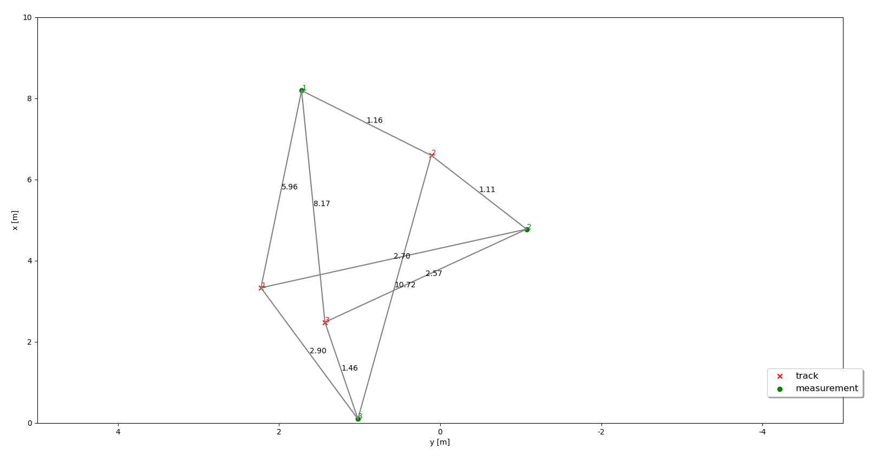
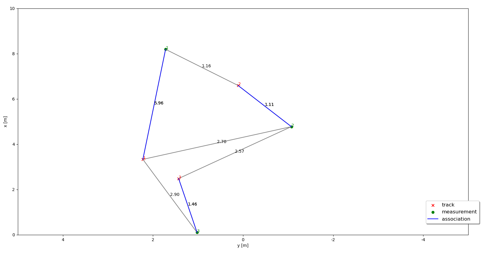

# Overview of Multi Tracking Objective

# initialization of the track object for a measurement

->left image shows the measurement of an object in the sensor coordinates
->middle image shows the gt of the object
-> rightmost image shows the initialized tracking object. which stores the information of the object ( x,y,z,vx,vy,vz) in the vehicle coordinate.

## Multiple Sensor 
having multiple sensor might lead to deletion of the object, if it's visible in one sensor and not in other for long period of time.

### Checking if the object is in the fov of the object:

If mod(alpha) < mod(psi) , then the object is in the fov

### gating
gating is a technique used to reduce computational complexity in data association by eliminating unlikely measurement-to-track associations. This is particularly useful in tracking systems, where multiple measurements must be assigned to known tracks.

The following image shows the representation of association matrix when we dont use the gating:

with Gating :
