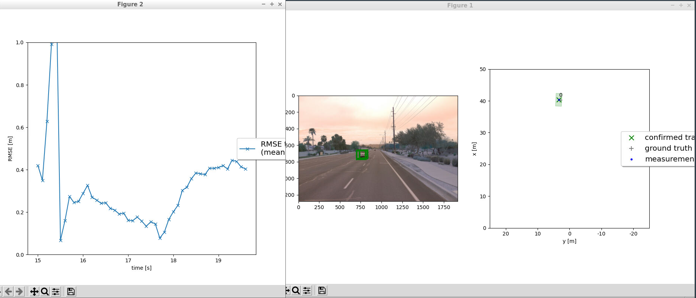
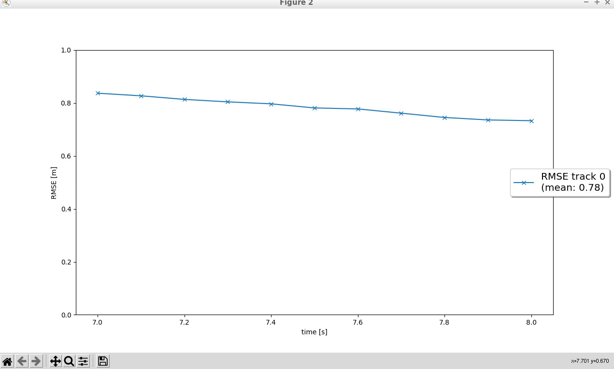
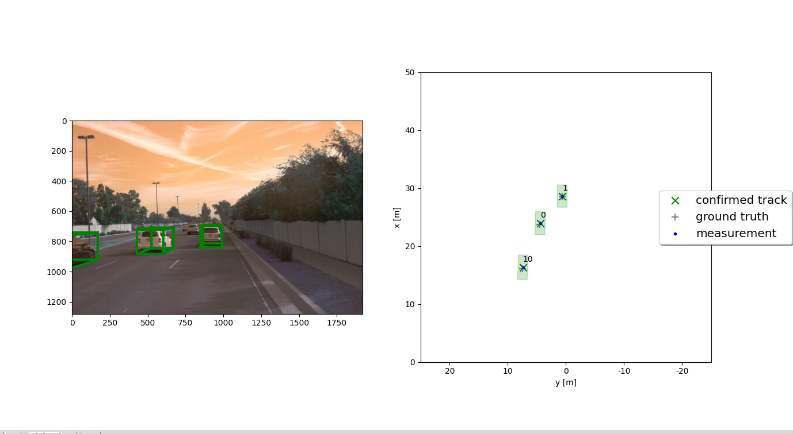
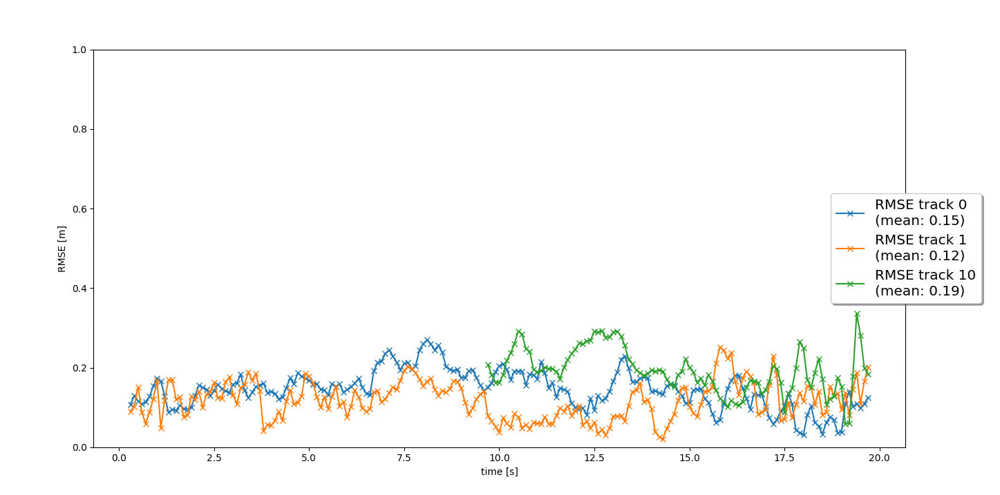
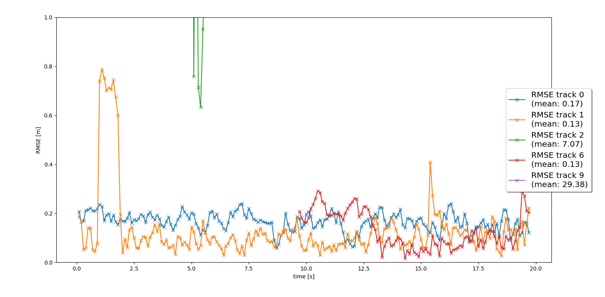

# Final Report
# Sensor Fusion and object Trakcing

- Implemented an extended Kalman filter.
- Implemented track management including track state and track score, track initialization and deletion.
- Implemented single nearest neighbour data association and gating.
- Sensor fusion by implementing the nonlinear camera measurement model and a sensor visibility check.

# Section 1 : EKF implementation

# section 2 : Track Management 
- Track initialization from unassigned measurements is implemented.
- A track score is defined and implemented.
- Track states are defined and implemented, e.g. “tentative”, “confirmed”. Old tracks are deleted for not updated tracks.
RMSE plot:

# section 3 : Nearest neighbor data association

->There are two tracks 0 and 1 without track losses in between from the start to end, so the RMSE plot shows a two lines for these. 
->Third track (10) is initiated after 10s for the car over taking on the left. 

# section 4 : Fusion of Nonlinear camera measurement model with LiDAR 

**Benefits of Camera-LiDAR Fusion vs. LiDAR-Only Tracking**  

- **Improved Accuracy:** Fusion reduces RMSE and enhances object tracking by leveraging LiDAR’s precision with camera’s visual details.  
- **Enhanced Object Classification:** Cameras provide richer object appearance information, aiding classification.  
- **Increased Robustness:** Cameras struggle in low light, while LiDAR handles adverse weather, ensuring consistent performance.  
- **Fewer Ghost Tracks:** Fusion reduces false positives compared to LiDAR-only tracking.  

**Challenges in Real-World Sensor Fusion**  

- **Sensor Quality & Calibration:** Environmental factors can degrade data quality, requiring regular maintenance.  
- **Ghost Tracks & False Positives:** Noise and over-sensitivity can introduce errors.  
- **Data Misalignment:** Imperfect synchronization can cause tracking inconsistencies.  
- **Processing Delays:** High object density can slow down computation.  
- **Tracking Fast-Moving Objects:** Rapid movements pose a challenge for accurate tracking.  

**Potential Tracking Improvements**  

- **Advanced Data Association:** Use GNN, JPDA, or MHT for better measurement-to-track matching.  
- **Adaptive Process Noise:** Dynamically adjust noise based on object motion.  
- **Improved Sensor Fusion Logic:** Integrate camera data more effectively for initialization and classification.  
- **Environmental Adaptability:** Implement weather-adaptive models to handle varying conditions.  
- **Occlusion Handling:** Predict occlusions and use interaction models for better tracking.  
- **Track Initialization & Deletion:** Use statistical validation and refined criteria for reliable track management.  
- **Enhanced Track Scoring:** Introduce a dynamic system balancing detection consistency and stability.