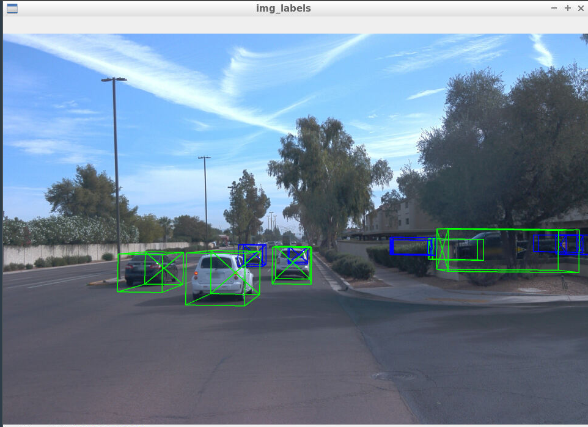

## Section 1 : 
a) Compute Lidar Point-Cloud from Range Image
- The **Waymo Open Dataset** stores LiDAR data as a **range image**.  
- The task involves extracting two data channels from the range image:  
- **Range**  
- **Intensity**  
- The extracted floating-point data needs to be converted into an **8-bit integer** value range.

    Stable Features :
    
    frame 27th
    
    frame 42nd
  
    - **Tail lights and number plates** are clearly visible on vehicles ahead. 
    - Features like bumper, body, etc are visible on vehicles that are close. 
    - **Other objects, like the road surface, appear pitch black** in the LiDAR range image.  
    - This indicates that **light reflects off different surfaces with varying intensities**, which is captured in the LiDAR range image.

b) Visualize lidar point-cloud

Frame #2

Frame #175

General Features Observed:

->Wheels: Circular shapes at the bottom, crucial for vehicle identification in point clouds.
->Rounded Front & Rear Ends: Contours of the hood, bumper, and trunk vary by model and LiDAR resolution.
->Body Shape & Size: Roofline, doors, and windows help distinguish vehicle types (sedan, SUV, etc.).
->Spacing & Alignment: Wheel distance indicates vehicle size and category.

## section-2 : Convert sensor coordinates to BEV-map coordinates 

### intensity channel

### height channel

## section-3 :  Model-based Object Detection

## section-4 :  Performance Evaluation for Object Detection

result for frames [50,150] for Sequence-1
precision = 0.9620689655172414, recall = 0.9117647058823529

